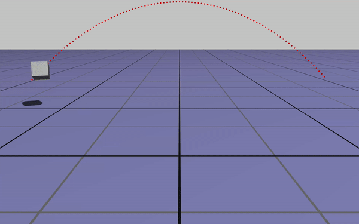
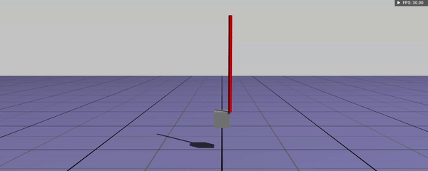

# Assignment 5 - Rigid bodies 

**Hand-in:** May 14, 2021, 18:00 CEST 

In this assignment, we will make a rigid body simulator somewhat like this.


*Figure 1: rigid body simulations. Videos from [MobyMotion](https://www.youtube.com/c/MobyMotion), [NVIDIA](https://youtu.be/1o0Nuq71gI4).*

Okay, to be honest, it's actually more like this.



*Figure 2: the rigid body simulator that we will create.*

Does it look boring? Believe me, what they do are fundamentally same. 

## Hand-in

Once you complete this assignment you should hand in
- a short video demonstrating your baseline (Ex.1 ~ Ex.3) implementation. (**filename: demo1.mp4**)
- a short video demonstrating Ex.4 implementation. (**filename: demo2.mp4**)
- code pushed to your github repository. 
    
The grading scheme is as follows
- baseline (80 %): based on your code, your answer in README (Ex.1) and a demo video. 
- advanced (20 %): based on your code and a demo video. 

Please leave your questions on GitHub, so your colleagues also can join our discussions. 

## Exercises

Okay now let's do this step-by-step :) Please note, from now on, we will assume every rigid body object has a same mass and a same dimension (for simplicity. Of course it's pretty straight-forward to extend this for more general cases).

### Ex.1 Numerical Integration (baseline - 40%)

What is a rigid body simulator? What does it do? In fact, it's nothing but a solver that find a solution of the following equations:


where **v**, **w**, **p**, **R** are linear velocity of center of mass of a rigidbody, angular velocity, position and orientation (3x3 rotational matrix) respectively (they are all expressed in world frame). The mass and moment of inertia (expressed in world frame) of the rigid body is *m* and **I**. We want to find **v**, **w**, **p**, **R** at time *t*, given profile of external force **F** and torque **t**. 

If we use an unit quaternion for orientation instead of a rotational matrix and discretize these equation, we get: 


where *h* is a timestep of the simulation. Note that here we use explicit (forward) Euler method.

Your very first task is implementing this numerical integration step in ```src/libs/sim/include/sim/RBPhysicsEngine.h```. Again, here we are going to use explicit (forward) Euler method. For now, just assume that only gravity is a source of external force. Once you complete the implementation, run ```rigidbodies``` app, and select **Projectile** in simulation scene menu and play (or just tap **SPACE**). You should see something like this: 


*Figure 3: the rigid body simulation that we will create.*

Okay, if your projectile simulation works properly, change the simulation rate and notice how the trajectory of the rigidbody changes. What do you notice and why it happens? **Leave your answer in a single sentence below. A correct answer will be counted as 10%.**
The trajectory of the rigidbody gets closer to the planned trajectory path for smaller step sizes because explicit euler gets more stable for smaller step sizes.
### Ex.2 Springs (baseline - 20%)

Okay, now let's add some external force sources: we will create springs in the simulation scenes. 

Your task is implementing your logic for spring forces that are applied from 
- Ex.2-1 (10%): a spring fixed to the world: one end of spring is attached to a rigidbody while another end is attached to some fixed point. 
- Ex.2-2 (10%): a spring which of both ends are attatched to rigid bodies.  

Every spring has a same spring constant, and its force is linear to displacement i.e. f = -k(x-x<sub>0</sub>). Once you finish your implementation, run ```rigidbodies``` app, and select **Fixed Springs** or **Rigid Body Springs** in simulation scene menu. Once you play the simulation... oh wait something bad thing is happening!



*Figure 4: The simulation is blown up!*

### Ex.3 Stable Simulation (baseline - 20%)

Well, in fact, this is super normal. I hope you already figured out what the problem is. If not... I will give you a hint. Did you notice that the trajectory of the projectile object (in **Projectile** scene) differs from the analytical trajectory (red)? Why it's the case?  

Okay, if you know why, then it's pretty clear what we need to do for making our rigid body simulator more stable. Your task is making our simulator stable enough so that we can simulate springs with *dt = 1/30* (simulation rate, 30Hz). **Record a demo video ~ 30 secs that shows all three simulation scenes and upload it to this repository with a name "demo1.mp4".** Do a double check if your video can be played without any additional encoding/decoding. It's also fine to upload your video to YouTube and add its link to on the top of this README.md. If I cannot play or access your video until the deadline, you won't get full points. 

Once you are done, again try to change the timestep *dt* and see what happens (this question is not for points, and you are free to discuss with your colleagues). 

### Ex.4 Impulse-based Collisions (advanced - 20%)

Well, it looks good already, but you may not be very happy from the fact that the rigid body objects go through the ground (or each other). Well, we can give a slightly more effort to simulate collisions between objects. For simplicity, let's simulate collisions between a spherical rigid body-ground only. 

Read the material, [ImpulseBasedCollisions](http://crl.ethz.ch/teaching/computational-motion-21/slides/ImpulseBasedCollisions.pdf) from our course website, see the comments in ```src/libs/sim/include/sim/RBPhysicsEngine.h``` (read the comments very carefully!), and implement impulse-based collision simulation logic for **restitutional** contact. Note that we assume 
- a collision only happens at the bottom 
- there's only one contact between a sphere and the ground
- the radius of the sphere is 0.1 m
- friction is infinite

Once you finish your implementation, run ```rigidbodies``` app, and select **Collisions** from simulation scene dropdown menu. You may see somewhat like this:


*Figure 5: restitutional collision simulations*

You might notice that the behaviors of the collisions are a bit unrealistic (can you explain why it's unrealistic, and why it happens? Please feel free to discuss with your colleagues). In fact, contact/collision simulation is not straight-forward and it is still an actively studied research topic. Today, we will just use a very simple model that can give you some idea of how a rigid body simulation pipeline works. **Try to reproduce the demo above,** and **record a demo video ~ 15 secs (~5 secs for each parameter sets) that shows all rigid body collisions with the following pairs of parameters (with dt = 1/30):**
- epsilon = 0
- epsilon = 0.5 (not necessarily to be exactly 0.5. Just use some value between 0 and 1.)
- epsilon = 1

**Upload it to this repository with a name "demo2.mp4".** Do a double check if your video can be played without any additional encoding/decoding. It's also fine to upload your video to YouTube and add its link to on the top of this README.md. If I cannot play or access your video until the deadline, you won't get full points. 

[demo1](demo1.mp4)\
[demo2](demo2.mp4)

If you are interested, see the following materials about collision simulations:
- [An Introduction to Physically Based Modeling: Rigid Body Simulation II — Nonpenetration Constraints](https://www.cs.cmu.edu/~baraff/pbm/rigid2.pdf)
- [Video Game Physics Tutorial - Part III: Constrained Rigid Body Simulation](https://www.toptal.com/game/video-game-physics-part-iii-constrained-rigid-body-simulation)