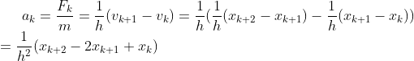
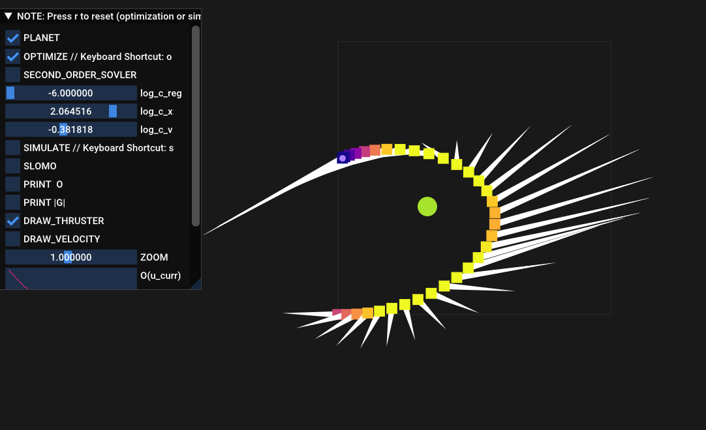
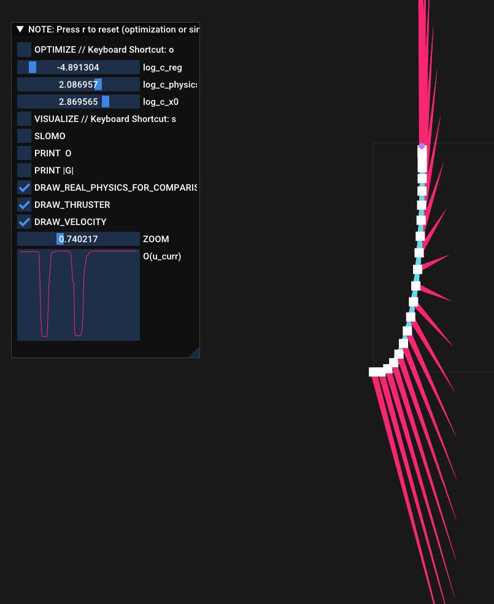

# Assignment 6 - Trajectory Optimization

**Hand-in:** May 28, 2021, 18:00 CEST 

First Name: Henry

Last Name: Trinh

Solution to Question 2:

where we used the hint, substitute v_k and v_k+1 with the first line of Eq (3) and reformulate the expression.

Solution to Question 5:

Newton's method takes about 1-8 steps until convergence where as the gradient descent takes at least 100 steps.
Newton's method is a second-order method. The updates for the optimization parameter take into account the Hessian matrix which speeds up the optimization in quadratic terms.

Solution to Question 7:

Solution to Question 8:

Solution to Question 9:

No it doesn't work. Using GD we are stuck in the start configuration. In direct transcription, the objective consists of many different sub-objectives with different weight regularizations. GD can't satisfy all sub-objectives with all different magnitudes and becomes numerically ill-conditioned.

Explanation of your approach to Question 10 (required for full credit):

We introduce a new constrain which keeps the spaceship in orbit even after 32 timesteps and without controll inputs, namely |x_sun - x_i| = r_prime. We predict for next timesteps k > K the positions of the spaceship. Those values are then constrained with the above mentioned constrain equation and added to our objective function.

---

Assignment writeup: http://crl.ethz.ch/teaching/computational-motion-21/slides/Tutorial-Write-Up-6.pdf

---

- NOTE: Don't forget to switch to Release mode or Release With Debug Info otherwise it's gonna be just unimaginably slow.
- NOTE: Tested builds: GCC 9.3 (Linux), Visual Studio 2019 (Windows), Clang 12.0.0 (Mac OS)
